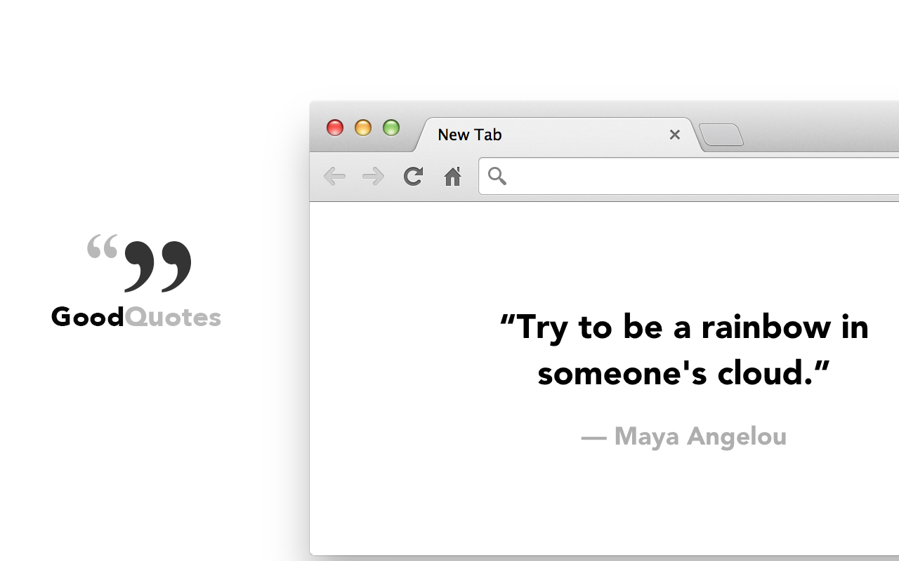

# Good Quotes

Replace new tab page with inspirational quotes

## Fetch quotes

`node scripts/fetch.js`

## Test

- Open Chrome browser.
- Go to `chrome://extensions/`.
- Click on 'Load unpacked' button.
- Select `good-quotes/package` directory.
- Open a new tab, click on 'Keep it' button in the confirmation dialog by Chrome browser.

## Deploy

- Compress `good-quotes/package` directory.
- Go to https://chrome.google.com/webstore/devconsole, and select 'Good Quotes' extension.
- Go to Package, and upload compressed file.
- Publish.
